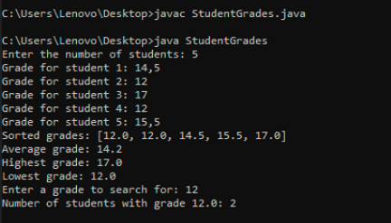
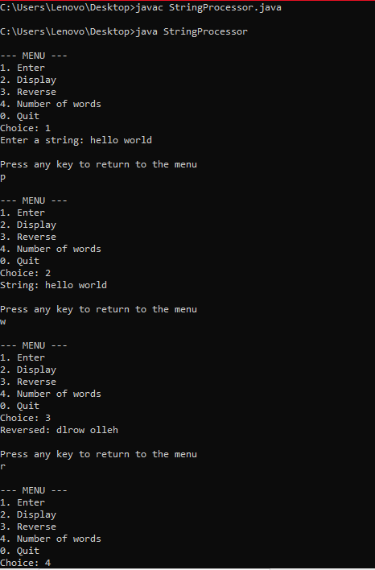
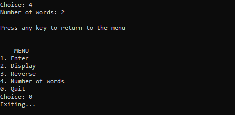

# TP Java: Strings and Arrays 
**Submitted by:** Majri Salma  
**Course:** Object-Oriented Programming (2025/2026)  
**Instructor:** Mme. Loubna Aminou

---

## Exercise 1: Student Grades Management
###  Problem Description:
Create a program to manage student grades using an array. The program must:
1. Sort and display the grades.
2. Calculate the average.
3. Find the maximum and minimum grades.
4. Count how many students have a specific grade.

###  Solution :
```java
import java.util.*;

public class StudentGrades {
    public static void main(String[] args) {
        Scanner sc = new Scanner(System.in);
        System.out.print("Enter the number of students: ");
        int n = sc.nextInt();
        double[] grades = new double[n];

        for (int i = 0; i < n; i++) {
            System.out.print("Grade for student " + (i + 1) + ": ");
            grades[i] = sc.nextDouble();
        }

        // 1
        Arrays.sort(grades);
        System.out.println("Sorted grades: " + Arrays.toString(grades));

        // 2
        double sum = 0;
        for (double g : grades) sum += g;
        System.out.println("Average grade: " + (sum / n));

        // 3
        System.out.println("Highest grade: " + grades[n-1]);
        System.out.println("Lowest grade: " + grades[0]);

        // 4
        System.out.print("Enter a grade to search for: ");
        double search = sc.nextDouble();
        int count = 0;
        for (double g : grades) {
            if (g == search) count++;
        }
        System.out.println("Number of students with grade " + search + ": " + count);
    }
}
```
###  Execution Result:


---

## Exercise 2: French Verb Conjugator (1st Group)
###  Problem Description:
A program that takes a French first-group verb (ending in "er") and displays its present tense conjugation.

###  Solution :
```java
import java.util.Scanner;

public class VerbConjugator {
    public static void main(String[] args) {
        Scanner sc = new Scanner(System.in);
        System.out.print("Enter a first-group verb (...-er): ");
        String verb = sc.nextLine().toLowerCase();

        if (verb.endsWith("er")) {
            String radical = verb.substring(0, verb.length() - 2);
            String[] endings = {"e", "es", "e", "ons", "ez", "ent"};
            String[] pronouns = {"je", "tu", "il/elle", "nous", "vous", "ils/elles"};

            for (int i = 0; i < 6; i++) {
                System.out.println(pronouns[i] + " " + radical + endings[i]);
            }
        } else {
            System.out.println("Err: This isn't a first group verb");
        }
    }
}
```
###  Execution Result:


---

## Exercise 3: String Operations Menu
###  Problem Description:
A menu-driven program that allows the user to:
1. Enter a string.
2. Display the string.
3. Reverse the string.
4. Count the number of words (handling multiple spaces).

###  Solution:
```java
import java.util.Scanner;

public class StringProcessor {
    public static void main(String[] args) {
        Scanner sc = new Scanner(System.in);
        String text = "";
        int choice = -1;

        while (choice != 0) {
            System.out.println("\n--- MENU ---");
            System.out.println("1. Enter");
            System.out.println("2. Display");
            System.out.println("3. Reverse");
            System.out.println("4. Number of words");
            System.out.println("0. Quit");
            System.out.print("Choice: ");
            
            choice = sc.nextInt();
            sc.nextLine(); 

            switch (choice) {
                case 1:
                    System.out.print("Enter a string: ");
                    text = sc.nextLine();
                    break;

                case 2:
                    System.out.println("String: " + text);
                    break;

                case 3:
                    String reversed = "";
                    for (int i = text.length() - 1; i >= 0; i--) {
                        reversed += text.charAt(i);
                    }
                    System.out.println("Reversed: " + reversed);
                    break;

                case 4:
                    if (text.trim().isEmpty()) {
                        System.out.println("Number of words: 0");
                    } else {
                        String[] words = text.trim().split("\\s+");
                        System.out.println("Number of words: " + words.length);
                    }
                    break;

                case 0:
                    System.out.println("Exiting...");
                    break;

                default:
                    System.out.println("Invalid choice. Try again.");
            }

            if (choice != 0) {
                System.out.println("\nPress any key to return to the menu");
                sc.nextLine(); 
            }
        }
        sc.close();
    }
}
```

###  Execution Result:


---

## Exercise 4: Character Occurrence Counter
###  Problem Description:
Read a string and count how many times each letter of the alphabet appears, ignoring case sensitivity.

###  Solution :
```java
import java.util.Scanner;

public class LetterCounter {
    public static void main(String[] args) {
        Scanner sc = new Scanner(System.in);
        System.out.print("Enter a line of text (max 100 characters): ");
        String text = sc.nextLine().toUpperCase(); 
        int[] nb_occ= new int[26];

        for (int i = 0; i < text.length(); i++) {
            char ch = text.charAt(i);
            if (ch >= 'A' && ch <= 'Z') {
                int index = ch - 'A';
                nb_occ[index]++;
            }
        }

        System.out.println("The string \"" + text + "\" contains:");
        for (int i = 0; i < 26; i++) {
            if (nb_occ[i] > 0) {
                char letter = (char) (i + 'A');
                System.out.println(nb_occ[i] + " occurrences of the letter '" + letter + "'");
            }
        }
        
        sc.close();
    }
}
```

###  Execution Result:


---

